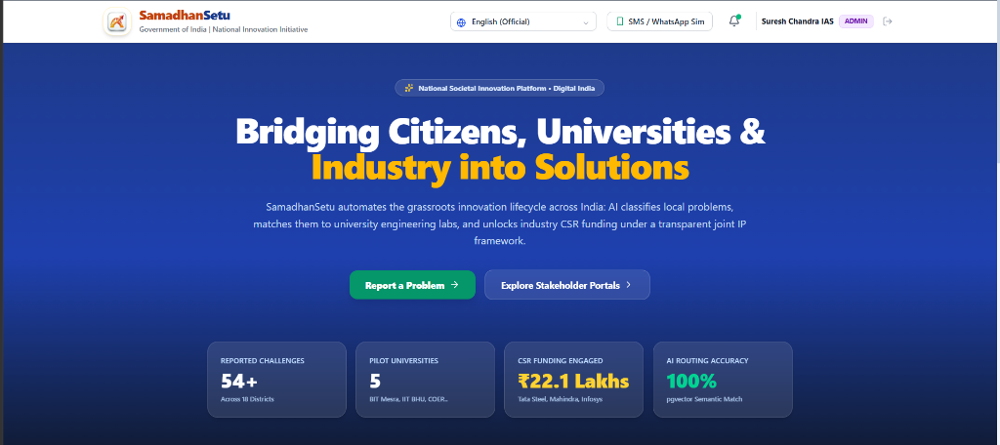
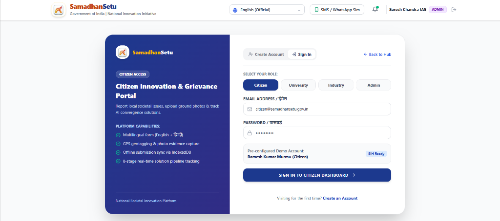
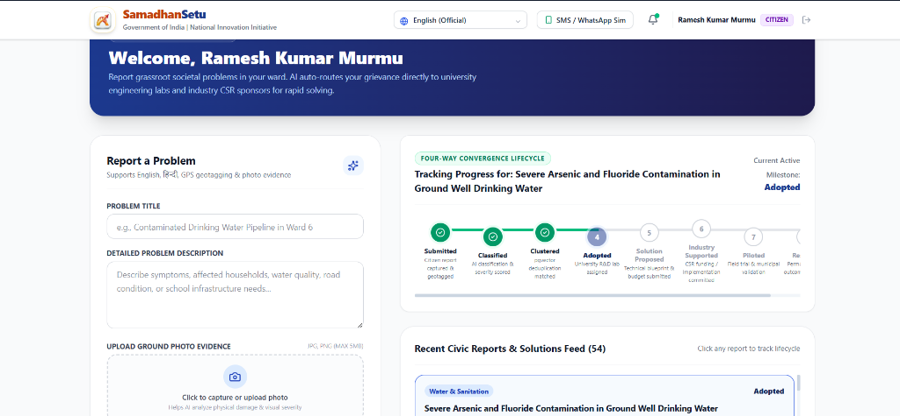
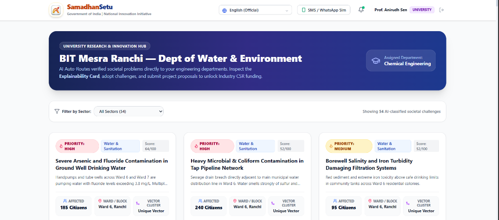
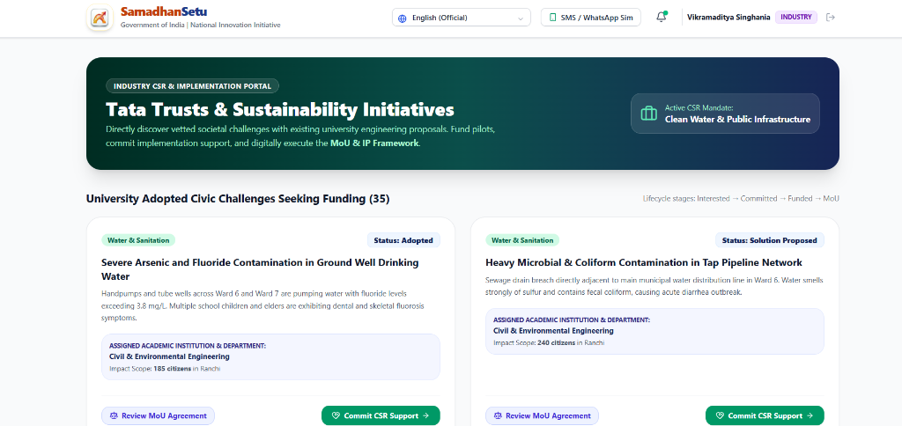

# SamadhanSetu (समाधानसेतु)
### AI-Powered National Societal Challenge Convergence Platform

SamadhanSetu is a next-generation civic innovation platform that bridges the gap between grassroots citizen grievances, academic research laboratories, industry CSR funding, and government administration.

---

## 📸 Platform Screenshots

### 1. Landing Page & Civic Innovation Hero


### 2. Multi-Stakeholder Unified Access Portal


### 3. Citizen Innovation & Grievance Dashboard


### 4. University R&D & Engineering Labs Hub


### 5. Industry CSR & Implementation Portal


---

## 🚀 Key Features

- **Multi-Stakeholder Access**: Tailored portals for Citizens, Universities, Industry CSR, and Administrators.
- **AI-Powered Routing & Explainability**: Categorizes civic challenges, scores severity, and automatically routes problems to suitable academic engineering departments.
- **Citizen Engagement**: Multilingual submission (English, Hindi, and regional languages), GPS geotagging, and ground photo evidence upload.
- **Four-Way Convergence Lifecycle**: End-to-end tracking from submission and AI clustering through university adoption, CSR co-funding, and municipal execution.
- **Industry CSR & Joint IP Framework**: Direct matching of vetted civic projects with corporate CSR initiatives and digital MoU consensus.
- **Live Notification Dispatch Simulator**: Real-time SMS and WhatsApp message dispatch simulations.

---

## 🏛️ System Architecture

| Architecture Layer | Implementation | Production Scale |
|---|---|---|
| **Frontend Layer** | React 19 + Vite, Tailwind CSS v4, Lucide Icons, multilingual support | Progressive Web App (PWA) + Voice NLP |
| **API Gateway** | Express.js middleware gateway (`authMiddleware`, `rbacMiddleware`, rate limiter) | Cloud API Gateway with JWT & OAuth2 |
| **Domain Services** | Modular microservices (`/submission`, `/classification`, `/routing`, `/collaboration`, `/notification`) | Containerized Docker / Kubernetes services |
| **Async Worker Queue** | Asynchronous worker queue for background NLP vector embedding & classification | BullMQ / Redis distributed workers |
| **Polyglot Persistence** | Relational data store + Cosine similarity vector search | PostgreSQL + pgvector cluster |
| **AI / NLP** | Dense semantic vector embeddings, similarity clustering, explainability engine | Sentence Transformers + IndicBERT |
| **Multi-Channel Dispatch** | In-app notification feed + Live SMS & WhatsApp simulator | MSG91 / Twilio Enterprise Gateway |

---

## ⚡ Quick Start

### Prerequisites
- [Node.js](https://nodejs.org/) v18+ (tested on Node v20/v22/v26)
- npm v9+

### 1. Backend Setup
```bash
cd backend
npm install
npm run seed      # Seeds initial challenges, pilot universities, and role accounts
npm run dev       # Starts backend API on http://localhost:5000
```

### 2. Frontend Setup
```bash
cd frontend
npm install
npm run dev       # Starts Vite dev server on http://localhost:5173
```

Visit `http://localhost:5173` in your browser.

---

## 👥 Stakeholder Demonstration Accounts

| Role | Email | Pre-configured Profile |
|---|---|---|
| **Citizen** | `citizen@samadhansetu.gov.in` | Ramesh Kumar Murmu (Citizen) |
| **University** | `university@samadhansetu.gov.in` | Prof. Anirudh Sen (BIT Mesra Ranchi) |
| **Industry** | `industry@samadhansetu.gov.in` | Vikramaditya Singhania (Tata Trusts) |
| **Admin** | `admin@samadhansetu.gov.in` | Suresh Chandra IAS (Admin) |

---

## 📄 License
This project is open-source under the MIT License.
